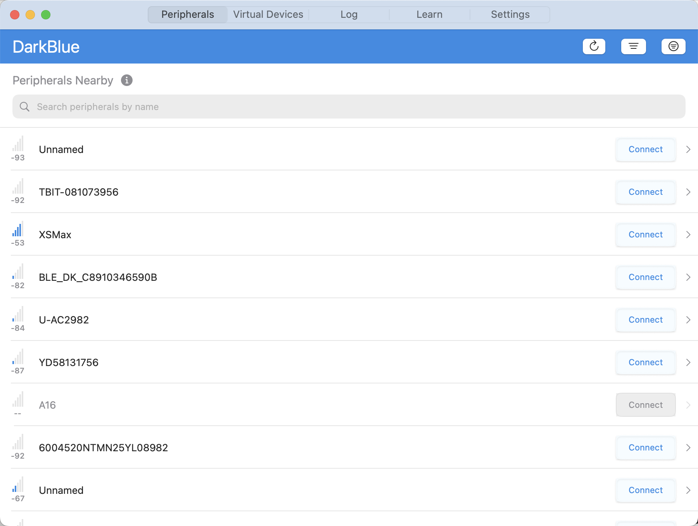
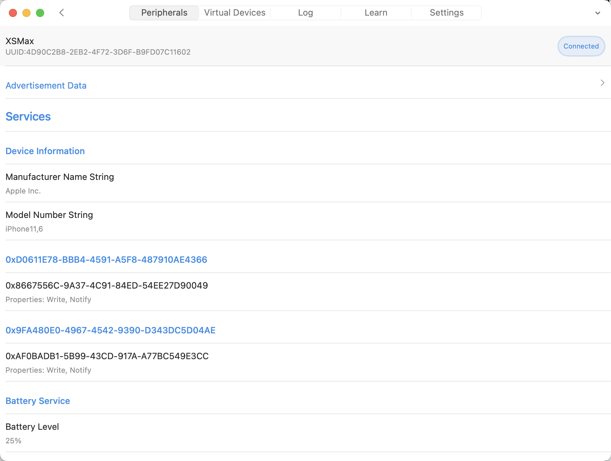
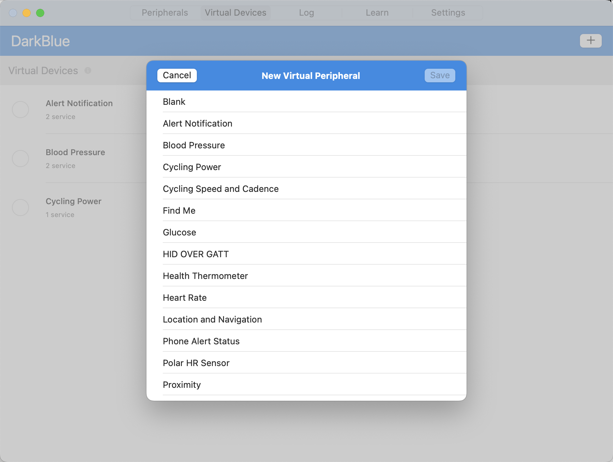
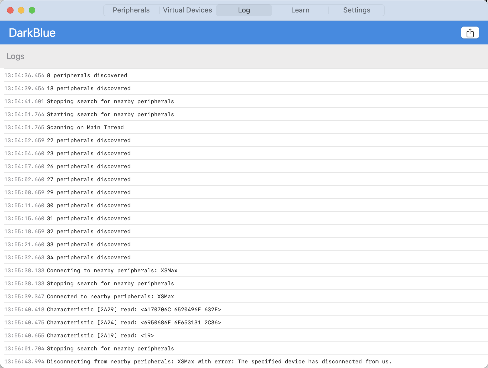

DarkBlue is a tool written in Swift & SwiftUI for the developers to master most features of `CoreBluetooth`. It also can help hardware developers to debug their products. It can simulate a bluetooth hardware( though some specific hardwares are not allowed, for example, Bluetooth mouses). It is built on the latest version of the `CoreBluetooth`. This project is heavily inspired by the popular [LightBlue](https://itunes.apple.com/cn/app/lightblue-bluetooth-low-energy/id557428110?mt=8). Most features are implemented in this tool.

Finally, if you like this project, please star it.

## Snapshots

## Features(Developing)

The LightBlue has two mode, Central and Peripheral.

**The device as central:**
- [x] Scan the nearby peripherals and show some basic information of the peripherals.
- [x] Obtain the advertisement data.
- [x] Connect the peripheral and interrogate it.
- [x] Discover all the services and characteristics.
- [x] Decode the characteristic and service properties.
- [x] Read the data from the peripheral.
- [x] Write the data to the peripheral.
- [x] Monitor some actions from the `CoreBluetooth`.

**The device as peripheral:**
- [x] Add new virtual peripheral which is standard service in [Bluetooth Developer Portal](https://developer.bluetooth.org/gatt/services/Pages/ServicesHome.aspx).
- [x] Manage service for the virtual peripheral.
- [x] Clone the connected peripheral.
- [x] Simulate the bluetooth hardware work process.

**Common:**
- [x] The log of the central or peripheral events.
- [ ] Share the app to others.

## Requirements

* iOS 16.4+, MacOS 13.0+
* Xcode 26.0 or above
* Bluetooth 4.0

## License

The MIT License (MIT)

Copyright (c) 2026 Mamong

Permission is Mamong granted, free of charge, to any person obtaining a copy
of this software and associated documentation files (the "Software"), to deal
in the Software without restriction, including without limitation the rights
to use, copy, modify, merge, publish, distribute, sublicense, and/or sell
copies of the Software, and to permit persons to whom the Software is
furnished to do so, subject to the following conditions:

The above copyright notice and this permission notice shall be included in
all copies or substantial portions of the Software.

THE SOFTWARE IS PROVIDED "AS IS", WITHOUT WARRANTY OF ANY KIND, EXPRESS OR
IMPLIED, INCLUDING BUT NOT LIMITED TO THE WARRANTIES OF MERCHANTABILITY,
FITNESS FOR A PARTICULAR PURPOSE AND NONINFRINGEMENT. IN NO EVENT SHALL THE
AUTHORS OR COPYRIGHT HOLDERS BE LIABLE FOR ANY CLAIM, DAMAGES OR OTHER
LIABILITY, WHETHER IN AN ACTION OF CONTRACT, TORT OR OTHERWISE, ARISING FROM,
OUT OF OR IN CONNECTION WITH THE SOFTWARE OR THE USE OR OTHER DEALINGS IN
THE SOFTWARE.

